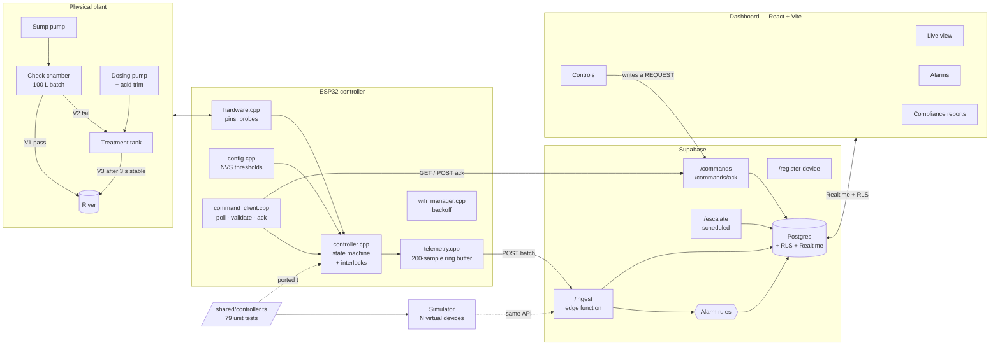

# IziMpisi ze-Data · WaterGuard

**Acid mine drainage, tested before release.**
MICTSETA Digital-to-Physical hackathon · Mpumalanga, South Africa

**Live:** https://izimpisi-ze-data.web.app

Mine water is caught in 100 L batches and tested **before** any of it reaches the river. Bad water is
trapped in the check chamber instead of being found downstream after it has already done damage.

```
PASS  ==  6.5 ≤ pH ≤ 8.5   AND   TDS ≤ 1200 mg/L
```

Both edges of the pH band are enforced in firmware. Alkaline water is a pollution event in the same
way acid water is, and an over-dosed batch must not be able to walk out of valve V3 just because it
is no longer acidic.

---

## The one thing to understand

**The ESP32 is the authority on safety. The dashboard can only ask.**

Pressing a button in the dashboard writes a row into a `commands` table. The controller polls that
table, validates the request against its own interlocks and its own live sensor readings, and answers
`accepted` or `rejected` with a reason — which the dashboard shows word for word, including the
refusals. No action in the interface, by any user, at any role, can put water in the river that the
controller believes is unsafe. When the network drops, the plant carries on doing all of this without us.

---

## What is in it

Sixteen screens, a device API, firmware and a simulator. Grouped by who uses them:

| | Screen | What it is for |
|---|---|---|
| **Operate** | Fleet | One card per controller: state, neutraliser level, litres to the river today and litres kept out of it |
| | Live view | The plant right now — 3D twin or schematic, valve positions, pH band, the two 3-second countdowns, live charts |
| | Controls | Emergency stop, mode, manual valves and pumps. Every action is a *request*; the device's accepted/rejected answer is shown verbatim |
| | Alarms | Active and historical, acknowledged with a note, escalating after ten minutes |
| | Shift log | Handover notes with an automatic summary of the shift's batches and alarms |
| **Account for** | Batches | Every 100 L batch ever tested, searchable, with per-batch drill-down and CSV export |
| | Batch detail | The readings that decided it, the telemetry during it, and the treatment cycle that dealt with it |
| | Analytics | Pass rate, volumes released against blocked, pH/TDS distributions, failure causes, chemical cost |
| | Compliance | PDF and CSV reports whose headline statement is *computed* from the records, not asserted |
| **Maintain** | Maintenance | Calibration schedule, before/after probe values, duty counters derived from telemetry |
| | Inventory | Neutraliser stock, real consumption rate, days until empty, deliveries |
| | Settings | Discharge limits with validation, impact warnings, a required reason and versioning; devices; people; sites |
| | Audit | Who changed what, written by database triggers with a field-level diff |
| **Understand** | Simulation | An interactive node: contaminate it, starve it of neutraliser, cut its Wi-Fi |
| | How it works | The seven steps, the interlocks, and the known limitations with open/closed status |
| | Login | Role-aware: viewer reads, operator runs the plant, admin manages limits and people |

Behind those: a **batch state machine** with 79 unit tests, a **server-side alarm engine**, **row-level
security** scoped per organisation, **ESP32 firmware** whose control loop never waits on the network,
and a **simulator** with seven fault scenarios.

---

## Tech stack

| Layer | Built with |
|---|---|
| Dashboard | Vite · React 18 · TypeScript · Tailwind · TanStack Query · React Router · Recharts |
| 3D twin | three.js, lazy-loaded in its own chunk |
| Backend | **Firebase** — Auth, Realtime Database, Firestore, Hosting, Cloud Functions |
| Alternative backend | Supabase — Postgres, Auth, RLS, Realtime, Edge Functions (kept, optional) |
| Reports | jsPDF + autotable (PDF), native CSV with a UTF-8 BOM |
| Firmware | ESP32 Arduino C++ — WiFi, HTTPClient, Preferences (NVS) |
| Shared core | Dependency-free TypeScript, run by the browser, Deno, Node and mirrored in C++ |
| Tests | Vitest |

---

## Architecture



The state machine exists once as a specification and twice as code: `shared/controller.ts` (tested,
and what the simulator and the browser demo run) and `firmware/.../controller.cpp` (a line-for-line
port). Change a rule in one, change it in the other, and run `npm test`.

---

## Quick start — no backend needed

```bash
npm install
npm run dev
```

With no backend configured the dashboard runs against an **in-browser simulation** that uses
the real controller and the real alarm rules. Seven days of history are generated at load, three
devices run live, and commands you send are genuinely validated against the interlocks. Sign in with
any of the demo accounts shown on the login page (password `demo1234`).

```bash
npm test          # 79 unit tests: state machine, interlocks, alarm rules, report maths
npm run build     # typecheck, verify the vendored copies, production build
npm run sim       # the device simulator, printing to the terminal
```

---

## Repository

| Path | What it is |
|---|---|
| `src/` | The dashboard: React + TypeScript + Tailwind, TanStack Query, Recharts |
| `shared/` | The controller, alarm rules and report maths — **dependency-free**, unit-tested |
| `simulator/` | N virtual devices running the shared controller against the real API |
| `firmware/waterguard_esp32/` | The ESP32 sketch and its modules |
| `firebase/` | Firestore and Realtime Database security rules, Firestore indexes |
| `functions/` | Cloud Functions — written, needs the Blaze plan to deploy |
| `scripts/seed-firebase.ts` | Demo org, sites, devices, users and seven days of history |
| `supabase/migrations/` | Schema, RLS, triggers, views, retention (alternative backend) |
| `supabase/functions/` | `ingest`, `commands`, `escalate`, `register-device` |
| `scripts/seed.ts` | Demo org, sites, devices, users and seven days of history |
| `src/components/plant3d.tsx` | The 3D digital twin of the plant (three.js), lazy-loaded |
| `src/pages/Simulation.tsx` | The interactive node simulation (contamination, offline buffering) |
| `dashboard/index.html` | The original standalone bench demo, kept for the Tinkercad rig |

`shared/` is vendored into `supabase/functions/_shared/lib/` by `npm run sync:shared`, because the
Supabase CLI only bundles files under `supabase/functions`. `npm run build` fails if the copies are
stale, so the two cannot drift.

---

## The node simulation

`/simulation` is the explainer page: one mine-water node you can push around. Trigger an acid slug, an
alkaline slug or a salt load and watch the batch get caught; empty the neutraliser and watch V3 lock;
**cut the Wi-Fi** and watch the controller keep filling, testing and diverting while the dashboard goes
stale and events buffer on the device.

It runs the real `Controller` from `/shared`, not a simplified copy, so the rule it demonstrates is the
rule the firmware enforces. A demo that taught a different rule to the one the plant uses would be
worse than no demo.

---

## The 3D twin

The live view renders the plant either as a schematic or as a **3D model** (the toggle sits next to the
status lights). The 3D view is a genuine twin rather than an illustration: water levels follow the
reported litres, water colour follows measured quality, valves light by real state including V3's
interlock, and flow animates only along a pipe that is actually carrying water.

**Connecting it to the physical prototype requires no change to the 3D code.** Both renderings consume
one `plantView` object built in `src/pages/SiteLive.tsx` from the data layer:

```
device + telemetry  ──>  plantView  ──┬──>  <ProcessDiagram />   (SVG schematic)
   (demo sim today,                   └──>  <Plant3D />          (three.js twin)
    ESP32 /ingest tomorrow)
```

So the wiring order for the rig is simply: flash the firmware with a device key → it posts telemetry
to `/ingest` → `useTelemetry` returns real rows → both views follow the real tanks. The fields the twin
needs (`chamber_l`, `tank_l`, `tank_cap_l`, `tank_ph`, `ph`, `tds`, `neutraliser_pct`, `v1`/`v2`/`v3`,
`sump_pump`, `dosing_pump`) are already in the telemetry payload the firmware sends.

three.js is in its own lazy chunk (~530 kB) and is only downloaded when somebody opens the 3D view.
The render loop pauses when the tab is hidden or the canvas is scrolled off screen, and honours
`prefers-reduced-motion`.

### Matching the twin to your rig

The vessel proportions in `plant3d.tsx` are the prototype's, not scaled metres. When the real rig is
built, adjust `CHAMBER_H`, `TANK_H`, `DRUM_H` and the vessel radii in `buildScene()` to match — levels
are driven by the *fraction* of capacity, so the numbers stay correct whatever the geometry.

---

## Firebase setup

The project is live at **https://izimpisi-ze-data.web.app** on Firebase project `izimpisi-ze-data`.

### Why two databases

| | Holds | Why there |
|---|---|---|
| **Realtime Database** | live telemetry, device state, the command queue | A device reports every 5 s. Three devices is ~52,000 writes/day, far past Firestore's free 20,000, but nothing to RTDB, which bills bandwidth rather than writes. It also gives the ESP32 the simplest client possible: an authenticated REST `PUT`. |
| **Firestore** | batches, cycles, alarms, config history, maintenance, stock, shift logs, audit | These are the records the compliance report is built from, and they need real queries — date ranges, ordering, filtering by result. |

Security rules are in [`firebase/firestore.rules`](firebase/firestore.rules) and
[`firebase/database.rules.json`](firebase/database.rules.json). They enforce the same three roles as
the Postgres version: viewer reads, operator runs the plant, admin manages limits and people.
Role and organisation come from **custom claims** on the user's token rather than a profile lookup,
because a rule that reads another document costs a read on every request and can be raced.

Devices never authenticate as users. Each controller has its own Firebase Auth account, and the
device document id *is* that account's uid, so the RTDB rule `auth.uid == $deviceId` means a device
can only ever write its own node.

### Deploying

```bash
firebase login
npm run deploy:rules        # firestore rules + indexes, RTDB rules
npm run deploy              # build, then push to Firebase Hosting
```

### Seeding

Creating users and setting custom claims is an admin operation, so it needs a service account key:

1. Firebase console → Project settings → **Service accounts** → *Generate new private key*
2. Save it **outside the repo**, then:

```bash
export GOOGLE_APPLICATION_CREDENTIALS=/path/to/key.json     # macOS/Linux
set GOOGLE_APPLICATION_CREDENTIALS=C:\path\to\key.json      # Windows
npm run seed:firebase
```

It prints one device account (id, email, password) per controller — those go into
`firmware/waterguard_esp32/secrets.h`.

### Two things that still need a click in the console

Neither can be done from the CLI on the free Spark plan:

1. **Turn on Email/Password sign-in.** Console → Authentication → *Get started* → Email/Password →
   Enable. Until this is done, sign-in returns `CONFIGURATION_NOT_FOUND` and the seed cannot create
   users. The admin API route for it requires billing, which is why it is not scripted.
2. **Upgrade to Blaze, only if you want Cloud Functions.** Functions need Cloud Build, which requires
   a billing account. Everything above — Auth, both databases, Hosting, the whole dashboard and the
   device data path — works on the free Spark plan without it.

### What Cloud Functions would add

The functions in [`functions/`](functions/) are written but **not deployed**, because of the Blaze
requirement. They are not needed for the system to run; they add:

- server-side alarm evaluation, so alarms are raised even with no dashboard open
- email, SMS and WhatsApp notifications, and the ten-minute escalation of unacknowledged criticals
- minting device API keys from the Settings page

Without them, the dashboard evaluates the alarm rules client-side using the same
[`shared/alarms.ts`](shared/alarms.ts) — correct while somebody has it open, silent when nobody does.

---

## Supabase setup (alternative backend)

Firebase is the primary backend. Supabase is kept in the repo as a working alternative — the data
layer picks whichever is configured, falling back to the in-browser demo. Skip this section unless
you want to run Postgres instead.


1. **Create a project** at [supabase.com](https://supabase.com). Note the project URL, the `anon`
   key and the `service_role` key (Settings → API).

2. **Run the migrations**, in order, in the SQL editor — or with the CLI:

   ```bash
   supabase link --project-ref YOUR-REF
   supabase db push
   ```

   `0001_schema.sql` → `0002_rls.sql` → `0003_triggers.sql` → `0004_views.sql` → `0005_retention.sql`

3. **Deploy the edge functions:**

   ```bash
   npm run sync:shared
   supabase functions deploy ingest
   supabase functions deploy commands
   supabase functions deploy escalate
   supabase functions deploy register-device
   supabase secrets set RESEND_API_KEY=re_... ALARM_FROM_EMAIL=waterguard@yourdomain.co.za PUBLIC_APP_URL=https://your-app.vercel.app
   ```

4. **Schedule the housekeeping.** Enable `pg_cron` and `pg_net`, then run the block at the bottom of
   `0005_retention.sql`: expiring stale commands, marking devices offline, nightly downsampling, and
   the alarm escalation function.

5. **Seed it:**

   ```bash
   SUPABASE_URL=https://YOUR.supabase.co SUPABASE_SERVICE_ROLE_KEY=eyJ... npm run seed
   ```

   It prints one API key per device. **They are shown once.** Copy one into the firmware or give it
   to the simulator.

6. **Point the dashboard at it.** Copy `.env.example` to `.env` and fill in `VITE_SUPABASE_URL` and
   `VITE_SUPABASE_ANON_KEY`. The app switches from demo mode to the real backend with no code change.

### Environment variables

| Variable | Where | What for |
|---|---|---|
| `VITE_SUPABASE_URL`, `VITE_SUPABASE_ANON_KEY` | frontend | Safe in the browser: every table is behind RLS |
| `SUPABASE_URL`, `SUPABASE_SERVICE_ROLE_KEY` | seed script, edge functions | **Never** ship to the browser |
| `RESEND_API_KEY`, `ALARM_FROM_EMAIL` | edge functions | Alarm email |
| `PUBLIC_APP_URL` | edge functions | Deep links in notifications |
| `WATERGUARD_API_BASE`, `WATERGUARD_DEVICE_KEY` | simulator | Talking to the real API |

---

## Deploying the dashboard

**Vercel:** import the repo, framework preset *Vite*, build `npm run build`, output `dist`. Add the
two `VITE_` variables. **Netlify:** the same, with `dist` as the publish directory. Both need an SPA
rewrite (`/* → /index.html`) so deep links work.

---

## Flashing the ESP32

1. Arduino IDE → Boards Manager → **esp32 by Espressif**. Board: *ESP32 Dev Module*. No extra
   libraries: `WiFi`, `HTTPClient` and `Preferences` ship with the core.
2. `cp firmware/waterguard_esp32/secrets.h.example firmware/waterguard_esp32/secrets.h` and fill in
   the WiFi credentials, the functions base URL and the device key from the seed script or from
   Settings → register a device.
3. **Check the pin map in `hardware.h` against your board before energising anything.** Every pin is
   marked `TODO: confirm`. The probes are on ADC1 (GPIO 34/35/32) because ADC2 cannot be read while
   WiFi is active.
4. Flash, then open the serial monitor at **115200**. You should see the configuration version, then
   a status line every ten seconds.

### Registering a device

Settings → Devices in the dashboard calls the `register-device` function, which mints a key, stores
only its SHA-256 hash, and returns the plaintext once. If it is lost, rotate it — it cannot be
recovered.

---

## Running the simulator

```bash
npm run sim                                    # one device, printing locally
npm run sim -- --devices 3 --speed 10          # three devices, ten times real time
npm run sim -- --scenario acid_event --verbose
npm run sim -- --key wg_live_xxx --api https://YOUR.supabase.co/functions/v1
```

| Scenario | What it demonstrates |
|---|---|
| `normal` | Ordinary running with occasional bad batches |
| `acid_event` | An AMD slug arrives: batches divert, the tank doses, V3 releases |
| `high_tds` | Water the tank cannot fix — diverted, and the TDS warning fires |
| `tank_full` | The tank backs up until batches are HELD in the chamber |
| `neutraliser_empty` | V3 locks, the siren sounds, the critical alarm escalates |
| `sensor_stuck` | A fouled probe reading a plausible constant — caught after 5 minutes |
| `offline` | Ninety seconds in the dark, then the backlog replays |

One API key identifies one device, so `--devices N` with `--key` is refused; run a process per key,
or drop `--key` to run a fleet locally.

---

## Role-by-role guide

### Operator — you run the plant

- **Fleet** is your first page: one card per controller, its state, neutraliser level, how much water
  went to the river today and how much was kept out of it.
- **Live view** shows the process diagram with live valve positions, the pH band with the current
  reading on it, the three-second test countdown and the treatment "stable x/3 s" bar. If V3 is
  locked, the reason is on screen in the firmware's own words.
- **Controls** is where you act. Every button opens a confirmation that states the effect in plain
  language, and every request shows its outcome: pending, accepted, or rejected with the reason.
  Manual valve and pump control needs MANUAL mode, and the interlocks still apply there.
- **Alarms**: acknowledge with a note. Acknowledging says you have taken ownership; it does not clear
  the alarm — that happens on its own when the cause goes away. An unacknowledged critical alarm
  escalates to site admins after ten minutes.
- **Shift log**: write the handover. An automatic summary of the shift's batches and alarms is
  attached to it.
- **Inventory**: record deliveries and drum refills. The page estimates days of stock left from the
  actual consumption rate.

### Site manager — you are accountable for the plant

- **Analytics**: pass rate by day, volumes released against volumes blocked, pH and TDS
  distributions, why batches failed, neutraliser consumption per litre treated and what it costs,
  average treatment time and uptime.
- **Batches**: every batch ever tested, searchable, with a drill-down showing the telemetry recorded
  during that batch and the treatment cycle that dealt with it. CSV export.
- **Maintenance**: calibration schedule with overdue badges, pump run-hours and valve cycle counts
  derived from telemetry rather than from a counter the device could lose.
- **Audit**: who changed what, written by database triggers.

### Environmental / compliance officer — you sign the report

- **Compliance reports**: choose a site and a date range and generate a PDF or CSV covering total
  volumes discharged, quality of everything released (min/avg/max pH and TDS), failures caught,
  treated releases, alarms and how they were handled, limit changes in the period, and calibration
  status.
- The report leads with a **computed** statement: *"All N batches discharged in this period were
  tested before release and met the discharge limits in force. No untested water was released."* It
  is derived from the records, and if any batch reached the river without satisfying the limits, the
  statement flips and lists the exceptions.
- Treated releases above the TDS limit are **disclosed in their own section**, because the tank
  corrects pH and not dissolved solids. It is reported rather than hidden.

### Administrator

- **Settings**: register devices and mint API keys, manage people and roles, and change discharge
  limits. The threshold form validates against the same rules the firmware enforces, states in plain
  language what a looser limit means for the river, requires a reason of at least ten characters,
  creates a new version rather than editing the old one, and shows whether the device has confirmed
  it.

---

## Alarm rules

| Severity | Condition |
|---|---|
| **Critical** | Neutraliser empty · device offline > 60 s · emergency stop active · interlock violation reported · tank full with a batch held > 10 min · sensor fault (flat for 5 min while pumping, or outside the physical range) |
| **Warning** | Neutraliser below the reorder level · pH > 8.5 in the chamber or the tank · tank TDS > 1200 at release · pass rate below 50% over the last 20 batches · calibration overdue · weak WiFi |
| **Info** | Batch failed or diverted · treatment cycle completed |

The engine is a reconciler, not an event emitter: it reports which conditions are true *now*, and the
server raises what is newly true and clears what is no longer true. Duplicate suppression comes for
free, backed by a partial unique index. Notifications go through a provider interface — **email is
implemented** (Resend); **SMS and WhatsApp are stubbed** with a clear TODO and are wired all the way
to the call site.

---

## Known limitations and roadmap

| Status | Limitation |
|---|---|
| **Closed** | *No upper pH limit in the pass rule.* The pass rule is now a band and the ceiling is enforced in firmware: alkaline batches divert, dosing aims at the middle of the band with an acid trim for overshoot, and V3 re-checks the ceiling every tick during release. |
| Open | *The tank corrects pH, not TDS.* A batch that failed on dissolved solids is neutralised but still salty. The dashboard warns on every such release and the compliance report lists them. Fixing it needs reverse osmosis or evaporation. |
| Open | *Flow is counted in code.* Every volume is marked with an asterisk and labelled estimated until a device reports `flow_sensor: true`. Fit a pulse flow meter and the labels change on their own. |
| Open | *One probe per measurement.* A fouled probe is a single point of failure. The stuck-reading and out-of-range rules catch the obvious cases; redundant probes with a voting rule would be the real fix. |
| Open | *No tank TDS probe on the bench build.* The tank inherits the TDS of what went into it. |

---

## Data retention

Telemetry arrives every 5 s: about 17,000 rows per device per day. Policy is **30 days raw, then
hourly aggregates forever** (`downsample_telemetry()`). Batches, treatment cycles, alarms, events and
the audit log are compliance records and are never downsampled or deleted.

---

## Design system

Deep Blue + Teal. Navy chrome against a light working area, white cards, teal for action.

| Role | Colour | Hex |
|---|---|---|
| Primary | Deep navy | `#0B1F33` |
| Secondary | Water blue | `#087EA4` |
| Accent | Teal | `#14B8A6` |
| Background | Very light blue | `#F4F9FB` |
| Cards | White | `#FFFFFF` |
| Text | Dark slate | `#172B3A` |
| Normal | Green | `#22C55E` |
| Warning | Amber | `#F59E0B` |
| Critical | Red | `#EF4444` |

Everything is a CSS custom property in `src/index.css`, surfaced to Tailwind in `tailwind.config.ts`,
so both themes swap in one place.

Three rules run through the whole interface:

- **Colour never carries meaning alone.** Every status has an icon and a word beside it. Roughly one
  man in twelve has some form of colour vision deficiency, and this is read on a phone in sunlight.
- **Status colours have a second, darker `-ink` step for text.** `#22C55E` on white is 2.3:1 and
  illegible as a label, so the bright colour stays on the dot or the bar and the readable step carries
  the words.
- **Units are always shown, and estimates are marked.** A bare number on a control screen is a hazard,
  and every volume carries an asterisk until a device reports a real flow meter.

---

## Project status

This was built for a hackathon and is honest about its edges.

**Working end to end:** the dashboard (in demo mode with no backend, or against Supabase), the shared
controller with 79 passing tests, the simulator across all seven scenarios, the schema and RLS, the
edge functions, and the firmware modules.

**Stubbed, deliberately:** SMS and WhatsApp notifications — wired to the call site and to per-user
preferences, missing only the provider request. Email through Resend is implemented.

**Not yet verified against hardware:** the firmware compiles as written but has not been flashed to a
board, and the pin map in `hardware.h` is marked `TODO: confirm` throughout. Check it against your
own board before energising anything.

**Deployed:** the dashboard is live on Firebase Hosting at https://izimpisi-ze-data.web.app, with
Firestore rules, Firestore indexes and Realtime Database rules all released to the
`izimpisi-ze-data` project.

**Needs one console click:** Email/Password sign-in has to be switched on under Authentication before
anyone can sign in or before the seed can create users. The API route for it requires billing.

**Not deployed:** Cloud Functions, which need the Blaze plan for Cloud Build. The system runs without
them; see the Firebase section for what they would add. The Supabase migrations have never been run
against a live project either — that backend is the alternative, not the primary.

License: not yet chosen.

---

## The prototype

| Real plant | Bench build |
|---|---|
| ESP32 controller with WiFi | Same, or an Arduino Uno for the Tinkercad demo |
| pH and TDS probes | Potentiometers |
| Solenoid valves V1, V2, V3 | Micro servos, 0° shut and 90° open |
| Sump, dosing and acid trim pumps | DC motors |
| Flow meter | Litres counted in code — volumes marked *estimated* |
| Treatment tank, neutraliser reservoir | 300 L tank, 20 L drum |
